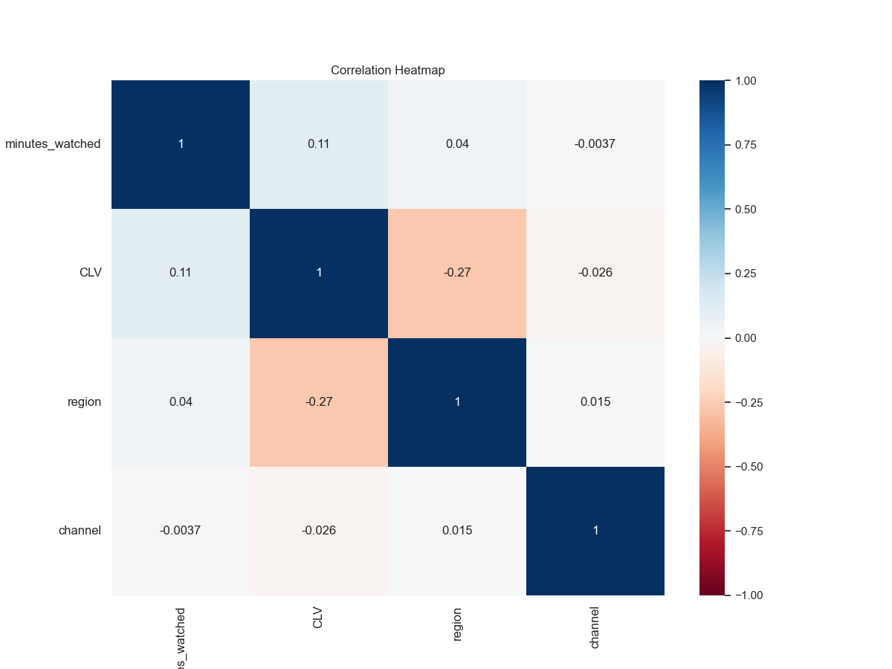
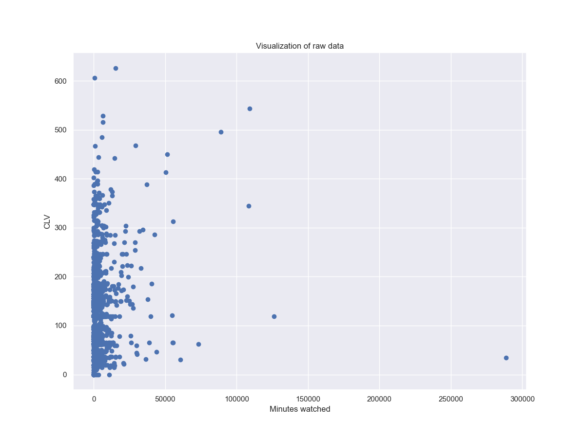
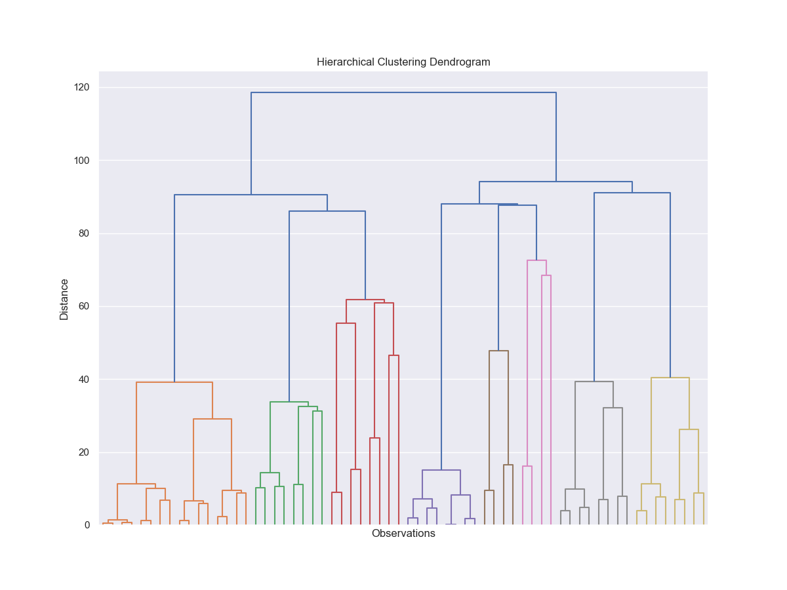
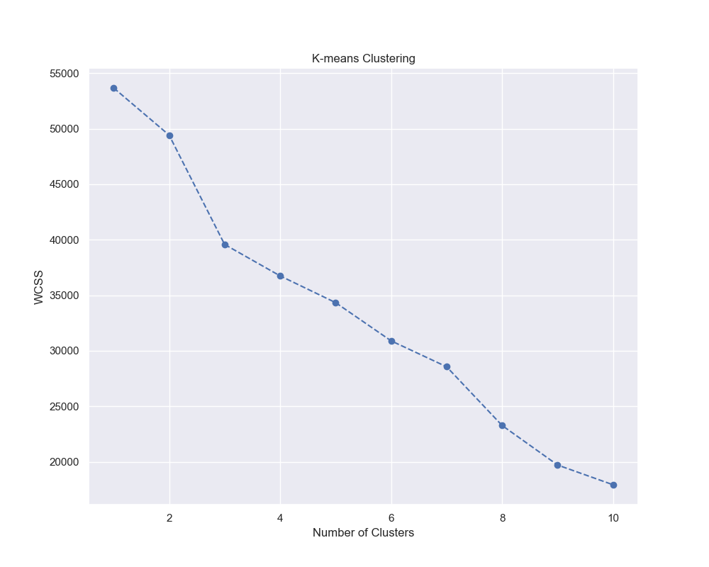

# 📊 Customer Analytics Segmentation Project

## 🧠 Overview

This project focuses on **customer segmentation** using data analysis and machine learning techniques.
The goal is to group customers into meaningful segments based on behavior and characteristics.

---

## 🎯 Objectives

* Perform Exploratory Data Analysis (EDA)
* Preprocess and transform data
* Apply clustering algorithms
* Extract actionable business insights

---

## 📁 Dataset

Includes:

* Minutes watched
* Customer Lifetime Value (CLV)
* Acquisition channel
* Region

---

## ⚙️ Technologies Used

* Python
* Pandas, NumPy
* Matplotlib, Seaborn
* Scikit-learn
* SciPy

---

## 🔍 Project Workflow

### 1. Exploratory Data Analysis

* Missing values handling
* Correlation analysis
* Data visualization

📌 Correlation Heatmap:

📌 Scatter Plot:

---

### 2. Feature Engineering

* One-hot encoding of categorical variables (`channel`, `region`)
* Feature renaming for clarity

---

### 3. Data Preprocessing

* Standardization using `StandardScaler`

---

### 4. Clustering

#### 🔹 Hierarchical Clustering

* Ward method
* Dendrogram visualization

📌 Dendrogram:

---

#### 🔹 K-Means Clustering

* Elbow Method used to find optimal clusters

📌 Elbow Method:

---

## 📊 Results

* Customers segmented into groups
* Segment profiles created
* Distribution analysis performed

---

## 🚀 Key Insights

* Customer behavior varies significantly by channel
* High-value segments identified
* Regional differences impact engagement

---

## 💡 Future Improvements

* Build dashboard (Power BI / Streamlit)

---

## 👩‍💻 Author

**Hajar Boutayeb**
Master’s Student in Data Science & Big Data

---

## ⭐ If you like this project, don’t forget to star the repo!
